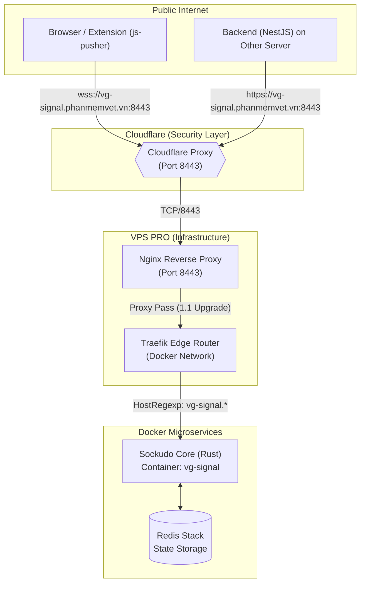
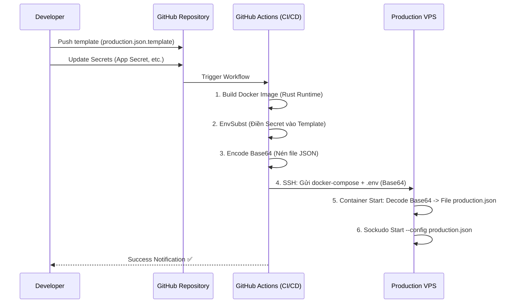
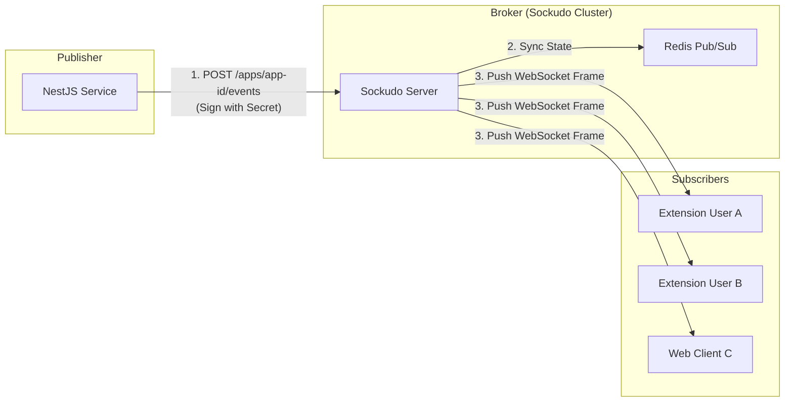

Đây là bản nâng cấp tài liệu kỹ thuật toàn diện cho hệ thống **Sockudo Signal Server**. Tài liệu này tích hợp các sơ đồ **Mermaid** để trực quan hóa luồng dữ liệu và làm rõ vai trò "Xương sống thời gian thực" của Sockudo trong hệ sinh thái của Vetgo

---

# 📘 TÀI LIỆU KỸ THUẬT VÀ VẬN HÀNH HỆ THỐNG SOCKUDO SIGNAL

## 1. VAI TRÒ CHIẾN LƯỢC CỦA SOCKUDO SIGNAL
Trong kiến trúc mới, Sockudo không chỉ là một máy chủ WebSocket đơn thuần, mà nó đóng vai trò là **Real-time Signal Backbone (Trục xương sống tín hiệu)**:

1.  **Task Orchestrator (Điều phối tác vụ):** Chuyển các lệnh điều khiển từ Backend (NestJS) xuống hàng nghìn Client (Browser/Extension) ngay lập tức.
2.  **Presence Monitor (Giám sát trạng thái):** Theo dõi ai đang online, thiết bị nào đang sẵn sàng nhận task thông qua Presence Channels.
3.  **Cross-Server Bridge:** Kết nối các dịch vụ chạy trên các server khác nhau (Multi-server) thông qua một cổng tín hiệu tập trung tại `vg-signal.phanmemvet.vn`.

---

## 2. SƠ ĐỒ KIẾN TRÚC HẠ TẦNG (SYSTEM TOPOLOGY)

Sơ đồ này mô tả cách Traffic đi từ Internet, băng qua các lớp bảo mật và định tuyến để chạm tới lõi xử lý Rust.



---

## 3. QUY TRÌNH CICD & AUTO-CONFIG INJECTION

Đây là điểm "Pro" nhất của hệ thống: **Cấu hình động**. Bạn không bao giờ phải SSH vào server để sửa file JSON. Mọi thứ được định nghĩa trong code và bảo mật bằng GitHub Secrets.



---

## 4. LUỒNG XỬ LÝ TÍN HIỆU (SIGNAL FLOW)

Mô hình **Publisher (Backend) -> Broker (Sockudo) -> Subscriber (Frontend)**.



---

## 5. HƯỚNG DẪN CẤU HÌNH CHI TIẾT (FOR DEVELOPERS)

### 5.1. Quy tắc Template JSON (`config/production.json.template`)
Để Sockudo không từ chối cấu hình, hãy tuân thủ:
*   **Trường bắt buộc là Số:** `max_connections`, `max_client_events_per_second`.
*   **Trường Optional/Limit:** `max_backend_events_per_second`, `max_read_requests_per_second`... **PHẢI để trong dấu ngoặc kép** (ví dụ: `"1000"`).

### 5.2. Tích hợp Backend (NestJS)
Sử dụng Hostname là subdomain riêng để thư viện `pusher` tự hiểu API path.
*   **Host:** `vg-signal.phanmemvet.vn`
*   **Port:** `8443`
*   **Secret:** Lấy từ GitHub Secrets (phải khớp với template).

### 5.3. Tích hợp Frontend (Javascript)
```javascript
const pusher = new Pusher('vg-zalo-key', {
    wsHost: 'vg-signal.phanmemvet.vn',
    wsPort: 8443,
    wssPort: 8443,
    forceTLS: true,
    enabledTransports: ['ws', 'wss'],
    cluster: 'mt1',
    wsPath: '', // Luôn để trống khi dùng Subdomain riêng
});
```

---

## 6. VẬN HÀNH & GIÁM SÁT (OPERATIONS)

### 6.1. Kiểm tra sức khỏe hệ thống (Health Checks)
Hệ thống cung cấp endpoint giám sát cho từng App riêng biệt:
*   **URL:** `https://vg-signal.phanmemvet.vn:8443/up/{app_id}`
*   **Ý nghĩa:** Trả về `200 OK` kèm các thông tin về Rate Limit hiện tại.

### 6.2. Lệnh debug nhanh trên VPS
Khi cần trace sâu vào hệ thống:

| Lệnh | Mục đích |
| :--- | :--- |
| `docker logs -f vg-signal` | Xem log trực tiếp (Kết nối/Lỗi) |
| `docker exec vg-signal cat /app/config/production.json` | Kiểm tra nội dung config sau khi decode |
| `docker network prune -f` | Giải phóng dải IP nếu deploy lỗi "overlapping IPv4" |
| `docker restart vg-signal` | Khởi động lại để nạp lại config/xóa cache |

---

## 7. CHIẾN LƯỢC MỞ RỘNG (SCALING STRATEGY)
Hệ thống hiện tại chạy 1 node Sockudo kèm 1 Redis. Để mở rộng:
1.  **Tăng Replicas:** Nâng số lượng container Sockudo lên trong `docker-compose`.
2.  **Redis Cluster:** Thay thế Redis đơn lẻ bằng cụm Redis Cluster để chịu tải hàng triệu kết nối.
3.  **Traefik Loadbalancer:** Traefik sẽ tự động chia tải (Round-robin) vào các container Sockudo đang sống.

---
*Tài liệu này được cập nhật lần cuối vào: 21/01/2026. Mọi thắc mắc vui lòng liên hệ đội ngũ DevOps.*